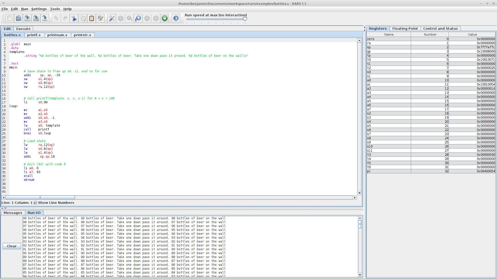

RARS -- RISC-V Assembler and Runtime Simulator
----------------------------------------------

RARS, the RISC-V Assembler, Simulator, and Runtime, will assemble and simulate
the execution of RISC-V assembly language programs. Its primary goal is to be
an effective development environment for people getting started with RISC-V. 

## Features

  - RISC-V IMFDN Base (riscv32 and riscv64)
  - Several system calls that match behaviour from MARS or SPIKE.
  - Support for debugging using breakpoints and/or `ebreak`
  - Side by side comparison from pseudo-instruction to machine code with
    intermediate steps
  - Multifile assembly using either files open or a directory

## Documentation

Documentation for supported [instructions](https://github.com/TheThirdOne/rars/wiki/Supported-Instructions), [system calls](https://github.com/TheThirdOne/rars/wiki/Environment-Calls), [assembler directives](https://github.com/TheThirdOne/rars/wiki/Assembler-Directives) and more can be found on the [wiki](https://github.com/TheThirdOne/rars/wiki). Documentation included in the download can be accessed via the help menu. 

## Download

RARS is distributed as an executable jar. You will need at least Java 8 to run it. 

The latest stable release can be found [here](https://github.com/TheThirdOne/rars/releases/latest), a release with the latest developments can be found on the [continuous release](https://github.com/TheThirdOne/rars/releases/tag/continuous), and the [releases page](https://github.com/TheThirdOne/rars/releases) contains all previous stable releases with patch notes.

Alternatively, if you wish to make your own jar and/or modify the code, you
should clone the repo with `git clone https://github.com/TheThirdOne/rars --recursive`.
Running the script `./build-jar.sh` on a Unix system will build `rars.jar`.

## Screenshot



## Accessibility

The source-code editor area has been hardened for screen-reader and
keyboard-only use (VoiceOver on macOS, NVDA / JAWS on Windows):

* The editor panel, the syntax-highlighting text area, the line-number gutter,
  the caret-position status label, and the *Show Line Numbers* checkbox all
  expose accessible names and descriptions via Java's
  `javax.accessibility` API. The *Show Line Numbers* checkbox additionally
  has an `Alt+L` mnemonic.
* `Control+Tab` moves keyboard focus *out* of the editor (forward) and
  `Control+Shift+Tab` moves it backward. Plain `Tab` still inserts an indent
  inside the editor as before, so users who do not need an escape key keep the
  old behaviour.
* RARS ships with two editor implementations. The default syntax-highlighting
  editor (`JEditTextArea`) paints its own glyphs and historically reported
  nothing useful to assistive technologies; it now provides an
  `AccessibleContext` of role `TEXT` with `MULTI_LINE` / `EDITABLE` states and
  exposes the caret position through `AccessibleValue`.
* For **full per-character screen-reader navigation** of the source code,
  enable **Accessibility Mode**. This switches the editor to the plain
  `javax.swing.JTextArea`-based implementation, whose
  `AccessibleJTextComponent` is fully understood by VoiceOver, NVDA and JAWS.

  You can enable Accessibility Mode in two ways:

  1. At launch, pass the system property:

     ```
     java -Drars.accessibility=true -jar rars.jar
     ```

  2. Persistently, via *Settings → Editor → Use Generic Editor* (the
     "Use Generic Editor" checkbox forces the same accessible editor and is
     remembered between sessions).

## Building

Requires JDK 17+ (Temurin tested). After cloning, initialise the JSoftFloat
submodule:

```
git clone --recurse-submodules https://github.com/Youssef-salem/acrars.git
cd acrars
bash build-jar.sh          # → rars.jar
java -Drars.accessibility=true -jar rars.jar
```

(If you cloned without `--recurse-submodules`, run
`git submodule update --init` first.)

### macOS app bundle

To produce a double-clickable, screen-reader-friendly `RARS.app` with the
Java 17 runtime embedded (so it works regardless of the system Java version):

```
bash build-app.sh          # → dist/RARS.app
open dist/RARS.app
```

Drag `dist/RARS.app` into `/Applications` to make it Spotlight-searchable.

### Windows installer

On Windows, with JDK 17+ and the [WiX Toolset 3.x](https://wixtoolset.org/) on
PATH:

```
build-jar.bat              REM produces rars.jar
build-app.bat              REM produces dist\RARS-1.6.msi
```

The MSI installs `RARS.exe` (with a private Java 17 runtime) into
`Program Files\RARS`, adds a Start menu entry, and registers the
`-Drars.accessibility=true` flag automatically.

If you don't want to install, just run the jar directly with Temurin 17:

```
java -Drars.accessibility=true -jar rars.jar
```

### Pre-built releases

Tag a commit `v1.6`, `v1.7`, … and push the tag — GitHub Actions
(`.github/workflows/release.yml`) builds `RARS.app` (macOS), `RARS.msi`
(Windows), `RARS.deb` (Linux) and the bare `rars.jar`, and attaches them to a
GitHub Release. Users can download the right artifact for their OS without
needing Java installed separately.

## Changes from MARS 4.5

RARS was built on MARS 4.5 and owes a lot to the development of MARS; its
important to note what are new developments and what come straight from MARS.
Besides moving from supporting MIPS to RISC-V and the associated small changes,
there are several general changes worth noting.

  - Instructions can now be hot-loaded like Tools. If you want to support an additional extension to the RISC-V instruction set. the .class files just need to be added to the right folder
  - ScreenMagnifier, MARS Bot, Intro to Tools, Scavenger Hunt, and MARS Xray were removed from the included tools. ScreenMagnifier, MARS Bot, Intro to Tools, and Scavenger Hunt were removed because they provide little benefit. And MARS Xray was removed because it is not set up to work with RISC-V, however if someone ports it, it could be merged in.
  - Removed delayed branching
  - Removed the print feature
  - Added a testing framework to verify compatibility with the RISC-V specification
  - Significant internal restructuring and refactoring.
